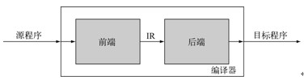
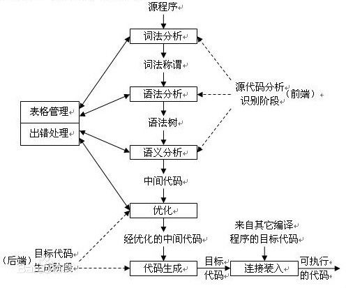

##Description##
========

1.本项目编写的是一个用 Java 语言编写的 MiniJava 的编译。 MiniJava是 Java 语言的子集。也就是说 MiniJava 语言的特性在 Java 中都合法，但是反过来不行，比如 MiniJava中的打印语句只能打印整形数据。

2. 具体的资料请参考： http://www.cambridge.org/us/features/052182060X/

3. 本编译器中实现了编译原理中讲解的知识，比如，词法分析（状态机），语法分析（自上而下和自下而上语法），语义分析（语法树），中间代码生成，优化代码，目标代码生成等这几个主要的步骤。
4. 一个完整的编译器分为前端和后端，如下图所示：

 

而前端和后端的具体任务具体分配如下：

此 MiniJava 编译器虽小，但五脏俱全。实现了编译器的主要功能。通过学习这个，对编译器内部结果可窥一斑。

源代码参考自： 
《Modern Compiler Implementation in Java，Second Edition》

